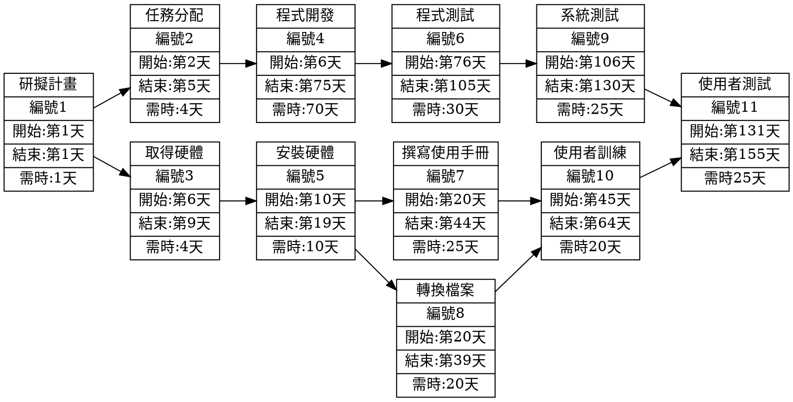
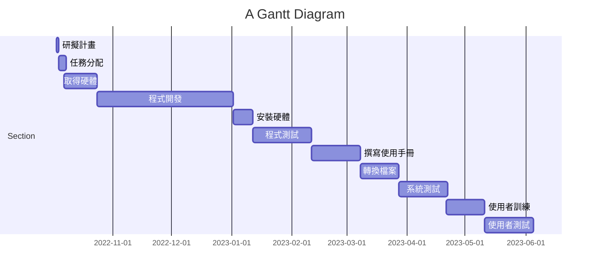

## PERT/CPM圖

```graphviz
digraph{
    node[shape=record];
    rankdir="LR";
    no1 [label = "研擬計畫 | 編號1 | 開始:第1天 | 結束:第1天 | 需時:1天"]
    no1 -> no2
    no1 -> no3
    no2 [label = "任務分配 | 編號2 | 開始:第2天 | 結束:第5天 | 需時:4天"]
    no3 [label = "取得硬體 | 編號3 | 開始:第6天 | 結束:第9天 | 需時:4天"]
    no2 -> no4
    no4 [label = "程式開發 | 編號4 | 開始:第6天 | 結束:第75天 | 需時:70天"]
    no3 -> no5
    no5 [label = "安裝硬體 | 編號5 | 開始:第10天 | 結束:第19天 | 需時:10天"]
    no4 -> no6
    no6 [label = "程式測試 | 編號6 | 開始:第76天 | 結束:第105天 | 需時:30天"]
    no5 -> no7
    no5 -> no8
    no7 [label = "撰寫使用手冊 | 編號7 | 開始:第20天 | 結束:第44天 | 需時:25天"]
    no8 [label = "轉換檔案 | 編號8 | 開始:第20天 | 結束:第39天 | 需時:20天"]
    no6 -> no9
    no9 [label = "系統測試 | 編號9 | 開始:第106天 | 結束:第130天 | 需時:25天"]
    no7 -> no10
    no8 -> no10
    no10 [label = "使用者訓練 | 編號10 | 開始:第45天 | 結束:第64天 | 需時20天"]
    no9 -> no11
    no10 -> no11
    no11 [label = "使用者測試 | 編號11 | 開始:第131天 | 結束:第155天 | 需時25天"]
}
```

##甘特圖

```mermaid
gantt
    title A Gantt Diagram
    
    section Section
    研擬計畫 : 2022-10-03, 1d
    任務分配 : 2022-10-04, 4d
    取得硬體 : 2022-10-07, 17d  
    程式開發 : 2022-10-24, 70d
    安裝硬體 : 2023-01-02, 10d
    程式測試 : 2023-01-12, 30d
    撰寫使用手冊 :2023-02-11, 25d
    轉換檔案 : 2023-03-08, 20d
    系統測試 : 2023-03-28, 25d
    使用者訓練 : 2023-04-21, 20d
    使用者測試 : 2023-05-11, 25d
```
